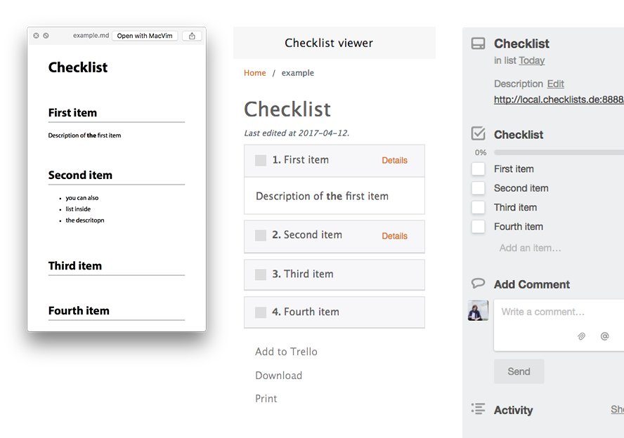

# ChecklistViewer

ChecklistViewer is a simple  wrapper around markdown files which will be rendered as checklists. Think of those markdown files as templates for recurring sets of todos you need to check off. For example project setups or monthly tasks with multiple steps.

You store the markdown checklist files in a seperate git repository so you can versioncontrol them and collaborate on them with everyone in your team. The wrapper adds a simple web interface around the markdown files to check off single todos. Additionally you can print the checklists or export them to your [Trello board](https://trello.com).




## Checklist format

The first heading in a file will be the name of the checklist, all second level headings are individual checklist items. The content beneath a heading is the item description (optional).

You can use [GitHub Flavored Markdown](https://guides.github.com/features/mastering-markdown/).

Example:

```
# Checklist

## First item

Description of __the__ first item

## Second item

- you can also us
- lists inside
- the description

## Third item

## Fourth item

```

Save your markdown files in an empty folder, and organize them into any folder structure you want.


## Installation

### Requirements

You need:

- [NPM](https://www.npmjs.com/get-npm)
- [Bower](https://bower.io/)
- [Composer](https://getcomposer.org/)

Clone the repository to your webserver and run `$ npm install && bower install && composer install` to fetch all dependencies, then build CSS and JS assets with `$ grunt`.

Copy the `.env.example` to `.env` and edit the values. You can define the base directory in wich the markdown files are stored.

If you want to export your checklists to Trello add your [Trello API Key](https://trello.com/app-key) to the `.env` file.

Create an empty directory `checklists/` and init a new git repository. In this direcotry add as many markdown files in the above syntax, you can also use folders to stucture them.

Open the project folder with the `index.php` in your browser! (maybe you need the change the `RewriteBase` in the `.htaccess` file to match your environment)
